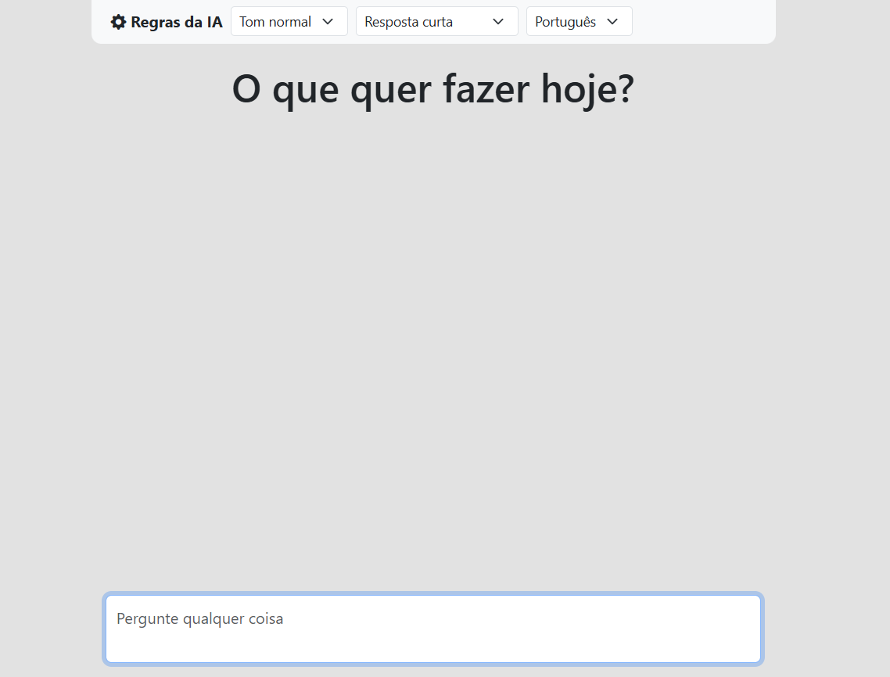
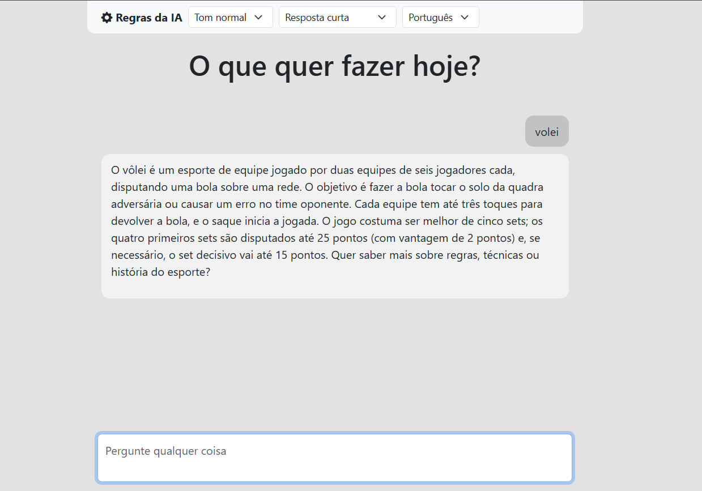
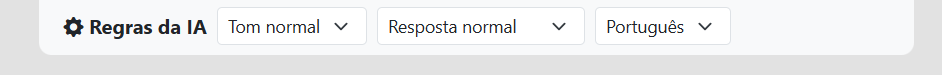

# Projeto IA com Ollama


Aplicação de chat com IA utilizando **Node.js**, **Express** e o **Ollama** para executar modelos localmente.

## 🛠️ Tecnologias utilizadas

- `express`: servidor web
- `marked`: conversão de Markdown para HTML
- `dompurify`: sanitização de HTML
- `jsdom`: suporte ao DOM no Node.js

## ⚙️ Como funciona

- O usuário envia uma mensagem pelo chat.
- O servidor Node.js + Express recebe a requisição.
- A mensagem é enviada para a API local do Ollama.
- O modelo gera uma resposta.
- A resposta é convertida de Markdown para HTML usando marked.
- O HTML é sanitizado com DOMPurify para evitar XSS.

## 🖥️ Tela da aplicação

### Tela Inicial


### Tela Interação


### Barra Superior


Na barra superior, é possível configurar o chat nos seguintes aspectos:

- **Tom**:
    - Tom normal
    - Formal
    - Amigável
    - Professor
- **Tipos de Resposta**:
    - Resposta curta
    - Resposta normal
    - Resposta detalhada
- **Idioma**:
    - Português
    - Inglêsa
    - Espanhol

## 📦 Requisitos do projeto

Instale os seguintes softwares antes de começar:

- [Node.js v18+](https://nodejs.org/en/download)
- [Ollama](https://ollama.com/download)

## 🔧 Instalação

- Clone o projeto:
    ```bash
    git clone https://github.com/seu-usuario/projeto-ia
    cd projeto-ia
    ```

- Instale as dependências:
    ```bash
    npm install
    ```

## 📁 Estrutura do projeto
```
projeto-ia
│
├── public
│   ├── css
│   │   └── style.css
│   │
│   ├── js
│   │   └── script.js
│   │
│   └── index.html
│
├── src
│   └── server.js
│
├── package.json
└── README.md
```

## 🚀 Executar o servidor
Execute
```bash
npm start
```

Servidor disponível em: [http://localhost:3000/](http://localhost:3000/)

